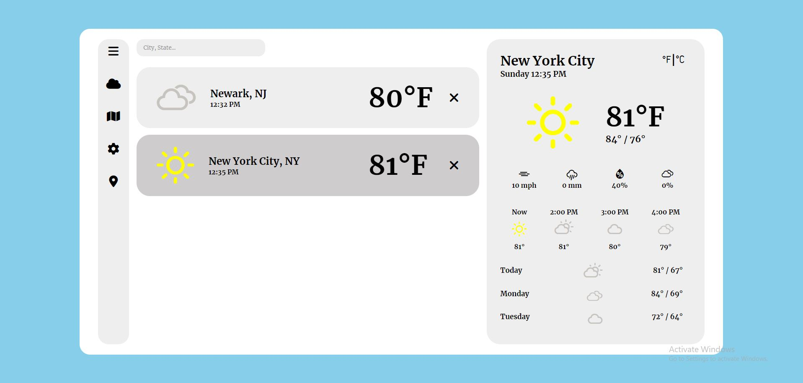
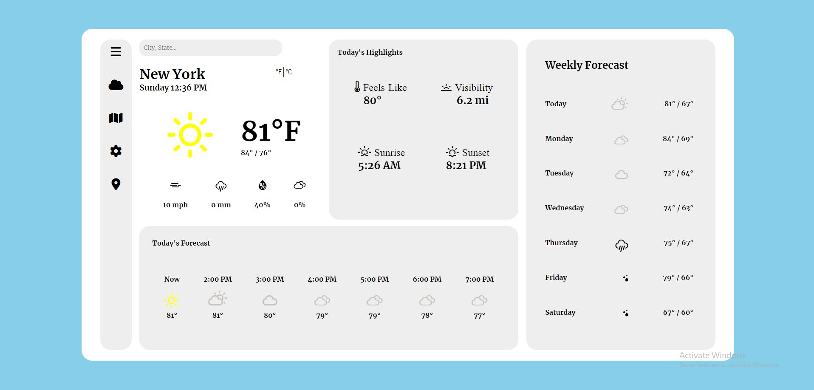
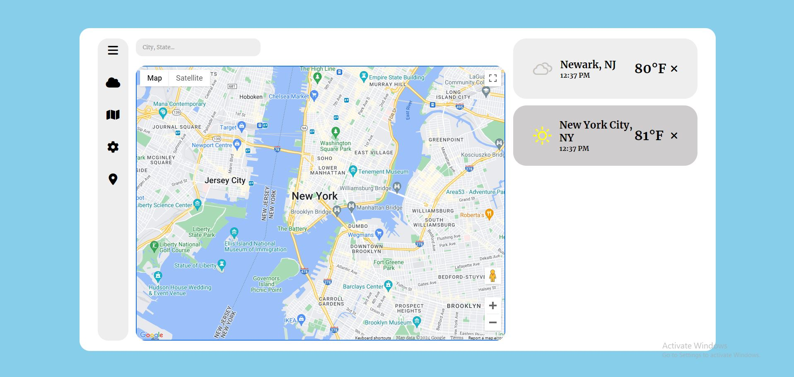

# Comprehensive Weather Application 

### Pages:
1. Menu Page: allows users to view multiple locations and click on each location element to display statistics about the specific location in terms of the temperature, climate, current and future forecasts; this display is a preview of the weather page.

2. Weather Page: contains a more detailed viewing of the menu page's display of the location's statistics and shows a broader timeline of the current and future forecast. It also includes specialize statistics such as the visbility, sunset times, etc. 

3. Map Page: similar to the menu page that displays all the locations queried by the user and when the user clicks on the location element, it opens up a map displaying the precise location on the map. 

4. Settings Component: includes a variety of options for the user to customize the application. 
5. Current Location: a shortcut for the user to have the browser ask for the user's current location and add that to the list of locations queried if not already present, and upon clicking for the current location, it will update the application and display the statistics for that location. 

### Icon Usages
The icons utilized within this application are open-sourced from **weather-icons** by erikflowers: https://erikflowers.github.io/weather-icons/

### API Usages 
There are multiple open-sourced APIs utilized within this application.
1. OpenWeatherMap API: This is the primary API being utilized within this application, which is responsible for fetching data for the current weather, climate, current and future forecast and other interesting statistics. To save the calls to the API, the data is stored within Firebase and is queried whenever a specific location that already is called to display it on the application (https://openweathermap.org/api). 
2. Google Maps API: This is Google API is utilized to display the location on the map and a marker pointing to that specific location whenever the user wants to display the specific location on the Maps Page (https://developers.google.com/maps/documentation/javascript). 
3. Geolocation API: This API is utilized to query the user's current location and have the coordinates from the query be retrieved to make calls from the OpenWeatherMap API and display the specific statistics on the application (https://developer.mozilla.org/en-US/docs/Web/API/Geolocation_API). 
4. Webstorage API: This API is used to save the locations inputted by the user and prevent additional calls for the same locations asked from being used to prevent expensive operations (https://developer.mozilla.org/en-US/docs/Web/API/Web_Storage_API). 
